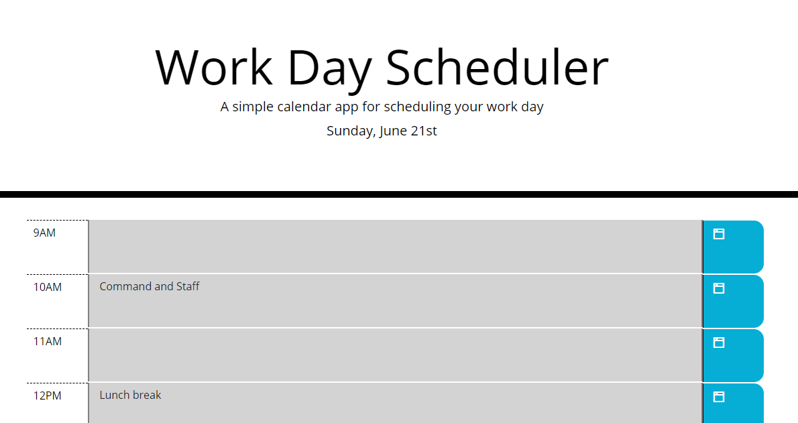

# Work Day Scheduler
This application creates a basic schedule layout that displays a block to schedule an event
for each hour of the day.  The blocks change color based on the current time of day.

## Software
HTML5  
CSS3  
JavaScript  
This code also includes links to Iconic, JQuery, and Bootstrap to optimize code

## Future tasks
The next crucial task for this application is to add persistence.  Following that, I 
would like to add the ability to create more than one task for a given time block.

## Links
GitHub Repository: https://github.com/nmcanall/work-day-scheduler  
Deployed Site: https://nmcanall.github.io/work-day-scheduler/

## Preview
